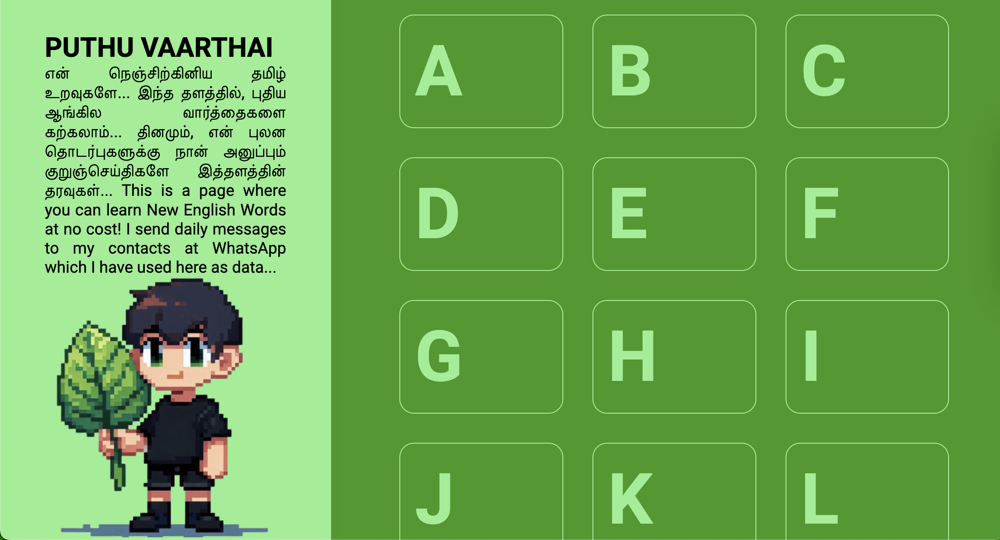
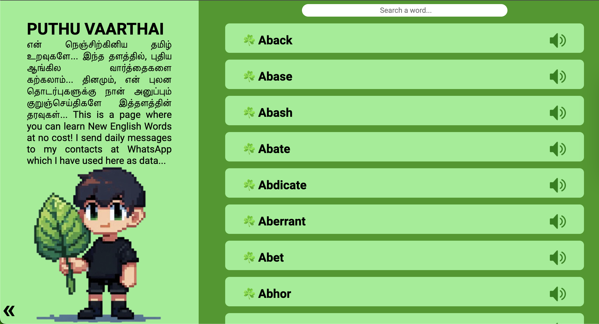
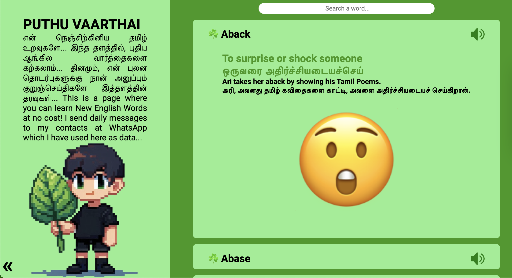

வணக்கம் 🙏

பழகினிய ஆங்கில பதங்களை புலனத்திலுள்ள என் தொடர்புகளுக்கு பகிர்ந்துள்ளேன்!
இது முடியா கற்றல் பயணம்!

Oxford Dictionary-ஐ மூலமாக்கொண்டு, இவை ஆவலுடன் உருவாக்கப்படுகின்றன. ஆவல் இருப்பதனால், சிரத்தைக்கும், அயர்வுக்கும் மனம் இடமளிப்பதில்லை!

இவற்றை, இன்னமும் எழிலுற, அயர்த்திடாமல் அனுதினமும் காண, இந்த தளத்தை உருவாக்கியுள்ளேன்…

இத்தளம் நாள்தோறும், புதுமையடையும்…
Lingua Franca-வை, இன்தமிழில் கற்பது இனிமை மற்றும் நல்லது! சில சொல்சேட்டைகளையும் உதாரணங்களில் காணலாம்… (என் நண்பர்கள் தாக்கப்படுவார்கள்!) 😜

இது ஓர் எளிய வழி! 
மொத்தமாய் ஒருநாளில்,
சுத்தமாய் முடியாது!
நித்தமாய் கற்போம்!
புத்தமாய் கற்போம்!

கற்போம்… 
அரிகரசுதன்

<h4>Learn New Words Daily!</h4>

<h4>The Words are from Oxford Dictionary!</h4>

<h4>Learn Lingua Franca through The Ancient Tamil!</h4>

